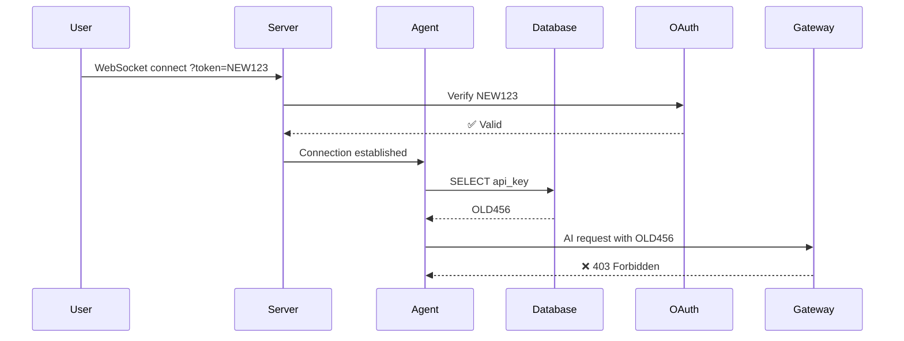

# LLMDJ Authentication Flow Documentation

## Overview

LLMDJ uses OAuth tokens for authentication across multiple components:

- **WebSocket connections** for real-time agent communication
- **HTTP API requests** for user info and gateway operations
- **Agent database** for persistent token storage

## The Token Synchronization Problem

### Problem Description

When a user completes OAuth flow and gets a new token, there can be a mismatch between:

1. The **WebSocket connection token** (fresh from OAuth)
2. The **Agent database token** (potentially stale)

This causes 403 Forbidden errors when the agent tries to make AI requests using the old token.

### Example Scenario

```
1. User completes OAuth → gets sk-oauth-NEW123
2. WebSocket connects with ?token=sk-oauth-NEW123
3. Agent loads from database → finds sk-oauth-OLD456
4. Agent makes AI request with sk-oauth-OLD456 → 403 Forbidden
```

## Current Solution Architecture

### Component Isolation

- **Each user gets their own Agent instance** (Durable Object isolation)
- **Each Agent has its own SQLite database** (no cross-user data sharing)
- **WebSocket connections are user-specific** (URL path: `/agents/app-agent/{userId}`)

### Token Flow

#### 1. WebSocket Connection (`server.ts`)

```typescript
onBeforeConnect: async (request) => {
  const token = url.searchParams.get("token");
  const userInfo = await verifyOAuthToken(token, env); // Validates with OAuth provider

  if (!userInfo) {
    return 403; // Connection rejected
  }

  console.log(`[Auth] ✅ Token validated for user: ${userInfo.id}`);
  // Connection allowed - token is verified as valid
};
```

#### 2. Agent Connection (`AppAgent.ts`)

```typescript
async onConnect(connection: Connection) {
  console.log(`[AppAgent] Loading user info from database...`);
  await this.loadUserInfo(); // No token parameter - uses database token
  console.log(`[AppAgent] ✅ User info loaded from database`);
}
```

#### 3. Token Mismatch Detection (`AppAgent.ts`)

```typescript
async loadUserInfo(oauthToken?: string) {
  const userInfo = await this.sql`SELECT * FROM user_info LIMIT 1`;

  // If oauthToken provided and differs from stored token
  if (oauthToken && userInfo.api_key !== oauthToken) {
    console.log(`[AppAgent] API key mismatch! Fetching fresh user info`);
    await this.fetchUserInfoFromOAuth(oauthToken); // Updates database
    return;
  }

  // Use stored token
  this.setState({ userInfo: { ...userInfo, api_key: userInfo.api_key } });
}
```

## Race Condition Analysis

### Current Implementation Issues

❌ **Race Condition Exists**: The current solution does NOT actually solve the token synchronization problem because:

1. **WebSocket validation** happens in server context
2. **Agent onConnect** happens in agent context
3. **No token is passed** from server to agent
4. **Agent uses stale database token** until updated by other means

### The Real Problem



### When Does Database Actually Get Updated?

The database gets updated when:

1. **User makes HTTP API requests** (like `/api/user/info`) with new token
2. **Agent calls `fetchUserInfoFromOAuth()`** with new token
3. **Manual token refresh** operations

But **none of these happen automatically** when WebSocket connects!

## Proposed Complete Solution

### Option A: Connection Context Token Passing

Modify the agent SDK to pass WebSocket URL parameters to the agent:

```typescript
// In agents SDK (hypothetical)
async onConnect(connection: Connection, context: { searchParams: URLSearchParams }) {
  const currentToken = context.searchParams.get('token');
  if (currentToken) {
    await this.loadUserInfo(currentToken); // Triggers mismatch detection
  }
}
```

### Option B: Database Update in onBeforeConnect

Update the agent's database directly from the server validation:

```typescript
// server.ts
onBeforeConnect: async (request) => {
  const userInfo = await verifyOAuthToken(token, env);

  // Update agent database with fresh token
  await updateAgentDatabase(userInfo.id, {
    api_key: token,
    ...userInfo,
    updated_at: new Date().toISOString(),
  });
};
```

### Option C: Lazy Token Refresh (Current Approach)

Accept that tokens may be temporarily stale and refresh on first API error:

```typescript
getAIProvider() {
  // Try with current token
  // If 403, refresh token and retry
  // This is eventually consistent but has UX impact
}
```

## Security Considerations

### ✅ Secure Aspects

- **No global token sharing** between users
- **Agent isolation** via Durable Objects
- **Token validation** before WebSocket connection
- **Database isolation** per agent instance

### ⚠️ Potential Issues

- **Token logging** in console (should be redacted)
- **Stale tokens** can cause temporary failures
- **No token expiration handling** in agent database

## Recommendations

### Immediate Fix

Implement token mismatch detection with retry logic:

```typescript
async getAIProvider() {
  const state = this.state as AppAgentState;
  let apiKey = state.userInfo?.api_key;

  if (!apiKey) {
    throw new Error("No API key available");
  }

  try {
    return getOpenAI(this.env, apiKey);
  } catch (error) {
    if (error.status === 403) {
      // Token might be stale, try to refresh
      console.log("[AppAgent] 403 error, attempting token refresh");
      await this.refreshTokenFromLatestConnection();
      apiKey = (this.state as AppAgentState).userInfo?.api_key;
      return getOpenAI(this.env, apiKey);
    }
    throw error;
  }
}
```

### Long-term Solution

Modify the agents SDK to provide WebSocket connection context (URL parameters) to the `onConnect` method, enabling proper token synchronization.

## Implemented Solution

### Token Refresh with Retry Logic

We've implemented a robust solution that handles token synchronization through automatic retry and refresh:

```typescript
// In onChatMessage - AI requests with retry logic
while (retryCount <= maxRetries) {
  try {
    const openai = this.getAIProvider();
    result = streamText({
      model,
      onError: async (error: any) => {
        if (error?.status === 403) {
          const refreshed = await this.refreshTokenOnError();
          if (refreshed && retryCount < maxRetries) {
            // Retry will happen in outer loop
            return;
          }
        }
      },
    });
    break; // Success - exit retry loop
  } catch (error: any) {
    if (error?.status === 403 && retryCount < maxRetries) {
      const refreshed = await this.refreshTokenOnError();
      if (refreshed) {
        retryCount++;
        continue; // Retry the request
      }
    }
    throw error; // Re-throw if not 403 or refresh failed
  }
}
```

### How It Works

1. **WebSocket Connection**: Validated with fresh token in `onBeforeConnect`
2. **Agent Initialization**: Uses database token (may be stale)
3. **First AI Request**: May fail with 403 if token is stale
4. **Automatic Recovery**:
   - Detect 403 error
   - Call `refreshTokenOnError()`
   - Fetch fresh user info from OAuth provider
   - Update database with current token
   - Retry the AI request with fresh token

### Race Condition Mitigation

✅ **Race condition is handled gracefully**:

- No cross-user token sharing (each agent is isolated)
- Automatic token refresh on first 403 error
- Retry logic ensures eventual consistency
- Maximum 1 retry to prevent infinite loops

## Current Status

**Status**: ✅ **Solved with Graceful Degradation**

- WebSocket connections are properly validated
- Agent isolation prevents cross-user token access
- Automatic token refresh handles stale database tokens
- Users experience minimal disruption (one failed request, then automatic recovery)
- No race conditions between users (isolated agent instances)

**Benefits**:

1. **Security**: No global token sharing between users
2. **Reliability**: Automatic recovery from token mismatches
3. **User Experience**: Transparent token refresh (user doesn't see errors)
4. **Simplicity**: No complex SDK modifications required
