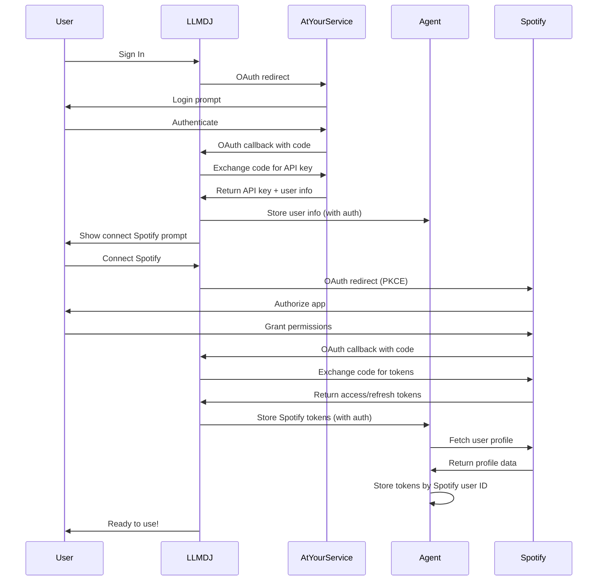

# 🎵 LLMDJ - AI Spotify DJ Agent


<a href="https://deploy.workers.cloudflare.com/?url=https://github.com/atyourserviceai/llmdj"></a>

An AI-powered Spotify DJ agent that controls your music through natural language conversation. Built on Cloudflare's Agent platform with the four-mode architecture for setup, configuration, planning, and execution.

## Features

- 🎵 **Natural Language Music Control**: Control Spotify through conversation
- 🔍 **Smart Music Search**: Find tracks, artists, albums, and playlists
- 📋 **Playlist Management**: Create, edit, and manage playlists
- 🎯 **Music Recommendations**: Get personalized suggestions based on your taste
- 🎛️ **Real-time Player**: Embedded Spotify Web Player with full controls
- 🏗️ **Four-Mode Architecture**: Onboarding → Integration → Plan → Act
- 🎨 **Split Layout**: Chat interface alongside music player
- 🌓 **Dark/Light Theme**: Modern, responsive UI
- 📱 **Mobile Responsive**: Works great on all devices

## Four-Mode Architecture for Music

### 🎯 Onboarding Mode

- Define your music preferences and listening habits
- Set up your personal DJ style and preferences
- Capture your music discovery methodology

### 🔧 Integration Mode

- Connect and test your Spotify account
- Verify API permissions and playback capabilities
- Test music control tools before going live

### 🎯 Plan Mode

- Discuss music discovery strategies
- Plan playlists and listening sessions
- Explore new genres and artists

### 🚀 Act Mode

- Direct music playback control
- Execute playlist management
- Real-time music recommendations

## Quick Start

### Prerequisites

- **AI@YourService Account** (required for authentication)
- **Spotify Premium Account** (required for playback control)
- **Spotify Developer App** (see setup below)
- **Cloudflare Account**
- **AI@YourService Gateway API Key** (or OpenAI API key)

> **🔒 Security Note**: This agent requires authentication through [AI@YourService](https://atyourservice.ai). All access is secured and no demo or public modes are available.

### Spotify Developer Setup

1. **Create Spotify App**:
   - Visit [Spotify Developer Dashboard](https://developer.spotify.com/dashboard)
   - Click "Create app"
   - Fill in app details (name: "LLMDJ", description: "AI DJ Agent")

2. **Configure Redirect URIs**:
   Add these redirect URIs to your Spotify app:

   ```
   http://localhost:5173/auth/callback          # Local development
   https://llmdj-dev.atyourservice.ai/auth/callback     # Dev environment
   https://llmdj-staging.atyourservice.ai/auth/callback # Staging
   https://llmdj.atyourservice.ai/auth/callback         # Production
   ```

3. **Get Credentials**:
   - Note down your `Client ID` and `Client Secret`
   - You'll need these for the next step

### Local Development

1. **Install dependencies**:

   ```bash
   pnpm install
   ```

2. **Configure environment**:
   - Copy `.dev.vars.example` to `.dev.vars`
   - Add your Spotify credentials:

   ```env
   SPOTIFY_CLIENT_ID=your-spotify-client-id
   SPOTIFY_CLIENT_SECRET=your-spotify-client-secret
   SPOTIFY_REDIRECT_URI=http://localhost:5173/auth/callback
   GATEWAY_API_KEY=your-gateway-api-key
   ```

3. **Start development server**:

   ```bash
   pnpm run dev
   ```

4. **Access the app**:
   - Open [http://localhost:5173](http://localhost:5173) or [https://llmdj.motin.eu](https://llmdj.motin.eu) (if using tunnel)
   - Sign in with your AI@YourService account
   - Click "Connect Spotify" to authorize
   - Start chatting with your AI DJ!

## Usage Examples

### Getting Started

```
"Hey, let's set up my music preferences"
→ Switches to onboarding mode to capture your music taste

"Test my Spotify connection"
→ Switches to integration mode to verify everything works

"Plan a workout playlist"
→ Switches to plan mode for strategy discussion

"Play some energetic music for my workout"
→ Switches to act mode and starts playback
```

### Music Control

```
"Play some jazz"
"Skip this song"
"Turn up the volume"
"Add this to my favorites playlist"
"Create a chill playlist for studying"
"What's similar to this artist?"
"Play my discover weekly"
```

### Smart Features

```
"Recommend something based on my current mood"
"Create a playlist for a dinner party"
"Find new music similar to what I'm playing"
"Show me what's trending in indie rock"
"Queue some songs for the next hour"
```

## Architecture

### Split Layout

- **Left Side**: Chat interface with your AI DJ
- **Right Side**: Spotify Web Player with real-time controls

### Agent Capabilities

- **Music Search**: Find any track, artist, album, or playlist
- **Playback Control**: Play, pause, skip, volume, seeking
- **Playlist Management**: Create, edit, and organize playlists
- **Queue Management**: Add songs to queue, reorder, clear
- **Music Analysis**: Get recommendations, audio features, related artists
- **Smart Learning**: Remembers your preferences and improves over time

### Storage & Learning

The agent remembers:

- Your music preferences and listening patterns
- Successful music recommendations
- Playlist creation history
- Music session context and mood preferences
- Spotify connection status and profile data

## Deployment

The project supports three environments:

### Development

- **Domain**: `llmdj-dev.atyourservice.ai`
- **Auto-deploy**: On push to `dev` branch
- **Manual deploy**: `pnpm run deploy`

### Staging

- **Domain**: `llmdj-staging.atyourservice.ai`
- **Manual deploy**: `pnpm run deploy -- --env staging`

### Production

- **Domain**: `llmdj.atyourservice.ai`
- **Auto-deploy**: On push to `main` branch
- **Manual deploy**: `pnpm run deploy -- --env production`

## OAuth Integration Architecture

LLMDJ uses a **dual OAuth system** for secure authentication:

### 1. AtYourService.ai OAuth (Primary Authentication)

- **Purpose**: Authenticate users and provide gateway API access
- **Flow**: User → AtYourService.ai → User gets API key for agent communication
- **Storage**: API key stored in `localStorage.auth_method`
- **Usage**: Required for all agent requests and tool execution

### 2. Spotify OAuth (Music Service Integration)

- **Purpose**: Access user's Spotify data and control playback
- **Flow**: User → Spotify → Agent stores tokens for music operations
- **Storage**: Tokens stored in agent's SQLite database, keyed by Spotify user ID
- **Usage**: Music search, playback control, playlist management

### OAuth Flow Sequence



### Key Implementation Details

**Agent Request Authentication**: All requests to agent endpoints must include the AtYourService.ai API key:

```javascript
// ✅ Correct - with Authorization header
const response = await fetch(`/agents/app-agent/${userId}/store-spotify-tokens`, {
  method: "POST",
  headers: {
    "Content-Type": "application/json",
    Authorization: `Bearer ${authMethod.apiKey}`, // AtYourService.ai API key
  },
  body: JSON.stringify({ /* Spotify tokens */ })
});

// ❌ Incorrect - missing auth (returns "Authentication required")
const response = await fetch(endpoint, {
  method: "POST",
  headers: { "Content-Type": "application/json" },
  body: JSON.stringify({...})
});
```

**Token Storage Architecture**:

- **AtYourService.ai tokens**: Frontend localStorage → Used for agent authentication
- **Spotify tokens**: Agent SQLite database → Used for music API calls
- **User association**: AtYourService.ai user ID used for agent room/instance
- **Music association**: Spotify user ID used for token lookup in database

## Spotify API Integration

### Required Permissions

The app requests these Spotify scopes:

- `user-read-playback-state` - Get current playback info
- `user-modify-playback-state` - Control playback
- `user-read-currently-playing` - See what's playing
- `playlist-read-private` - Access your playlists
- `playlist-modify-public` - Modify public playlists
- `playlist-modify-private` - Modify private playlists
- `user-top-read` - Access top artists and tracks
- `user-library-read` - Access saved music
- `user-library-modify` - Save/unsave music

### Rate Limits

Spotify has API rate limits. The app handles this gracefully:

- Automatic retry with exponential backoff
- User-friendly error messages
- Graceful degradation when limits are hit

## Troubleshooting

### Common Issues

**"Playback not available"**

- Ensure you have Spotify Premium
- Make sure Spotify is open on at least one device
- Check that your Spotify app is active

**"Authentication failed"**

- Verify your Spotify app credentials
- Check that redirect URIs match exactly
- Ensure your Spotify app is not in development mode restrictions

**"No devices available"**

- Open Spotify on your computer or phone
- Start playing something first to activate the device
- The Web Player will become available as a device

### Getting Help

- Check the [Spotify Web API documentation](https://developer.spotify.com/documentation/web-api/)
- Review your Spotify app settings in the [Developer Dashboard](https://developer.spotify.com/dashboard)
- Make sure all redirect URIs are configured correctly

## Development

### Project Structure

```
src/
├── agent/                 # AI agent implementation
│   ├── tools/            # Spotify integration tools
│   ├── prompts/          # Agent prompts and personality
│   └── storage/          # Music data persistence
├── components/           # React UI components
│   ├── spotify-player/   # Music player components
│   ├── chat/            # Chat interface
│   └── auth/            # Authentication components
├── lib/                 # Core utilities
│   ├── spotify-api.ts   # Spotify Web API client
│   ├── auth.ts          # OAuth handling
│   └── hooks/           # React hooks for Spotify
└── app.tsx              # Main application
```

### Development Patterns & Best Practices

#### 🗄️ **Database Migrations**

- Auto-migration on startup with graceful duplicate column handling (see `src/agent/AppAgent.ts` `initialize()` method)
- Expected errors logged as info, unexpected errors show stack traces
- All migrations are idempotent and safe to run multiple times

#### 🧠 **Agent State Management**

- Spotify auth stored in `agent.state.spotifyAuth` for immediate tool access
- Set state: `await agent.setState({ ...currentState, newData })`
- Read in tools: `const { agent } = getCurrentAgent<AppAgent>(); const data = agent.state.someField`
- UI access: Agent state available via `useAgent()` hook in React components
- Automatic persistence across sessions with built-in serialization

#### 🔧 **Tool Response Format**

- **Success**: `{ success: true, message: "...", data?: any }`
- **Logical failure**: `{ success: false, message: "..." }` (no error field)
- **Execution error**: `throw new Error("...")` (shows stack trace)
- UI detects failures via `success === false` + presence of `message` or `error`

#### 🎯 **Tool Development**

- Use descriptive, action-oriented names (`connectSpotifyAccount` not `spotifyTool`)
- Proper logging with tool context: `console.log("[toolName] ...")`
- Handle Spotify API rate limits with retry logic

#### 🔐 **Spotify Authentication Patterns**

**IMPORTANT**: Always use the modern authentication pattern for all Spotify tools:

```typescript
// ✅ CORRECT - Modern secure pattern (used by all current tools)
const { agent } = getCurrentAgent<AppAgent>();
const authResult = await getSpotifySDKFromAgent(agent);
if (!authResult.success) {
  return { success: false, message: authResult.message };
}
const { spotify, spotifyUserId } = authResult;
```

**Why this pattern?**

- `getSpotifySDKFromAgent()`: Retrieves tokens from database, handles automatic token refresh, includes comprehensive error handling, and provides a ready-to-use Spotify SDK instance

**For all Spotify tools**:

1. Use `getSpotifySDKFromAgent(agent)` for authentication
2. Check `authResult.success` before proceeding
3. Extract `spotify` and `spotifyUserId` from the result
4. The function handles token refresh, validation, and error messaging automatically

#### 📊 **Performance Notes**

- Agent state preferred over DB queries for frequent access
- Database for historical data and complex queries
- Consider agent state size and clear unused data when possible

### Available Scripts

- `pnpm run dev` - Start development server
- `pnpm run build` - Build for production
- `pnpm run deploy` - Deploy to Cloudflare
- `pnpm run test` - Run tests
- `pnpm run format` - Format code
- `pnpm run check` - Type checking and linting

## License

MIT License - see [LICENSE](LICENSE) file for details.

## Contributing

Contributions welcome! Please read our contributing guidelines and submit pull requests to the `dev` branch.

---

🎵 **Ready to let AI be your DJ?** Connect your Spotify and start the conversation!
